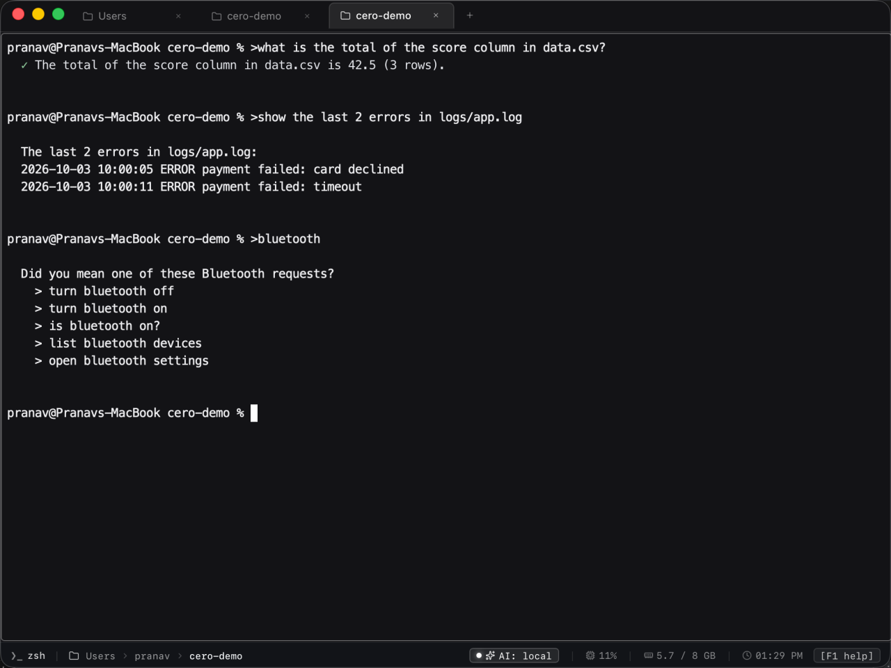
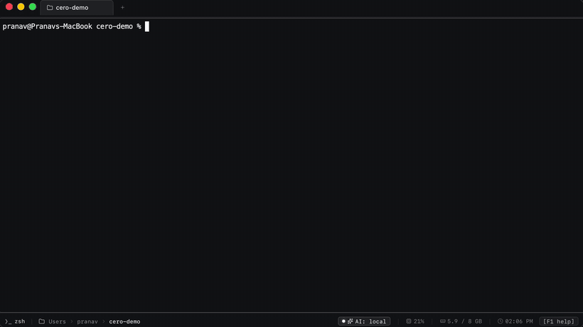
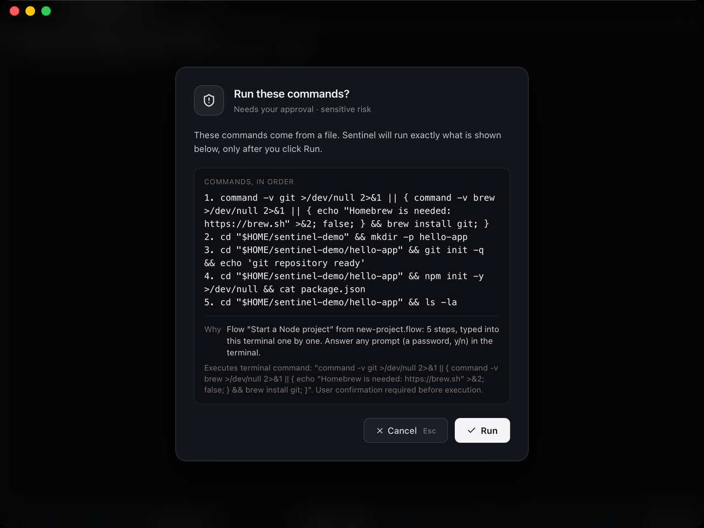
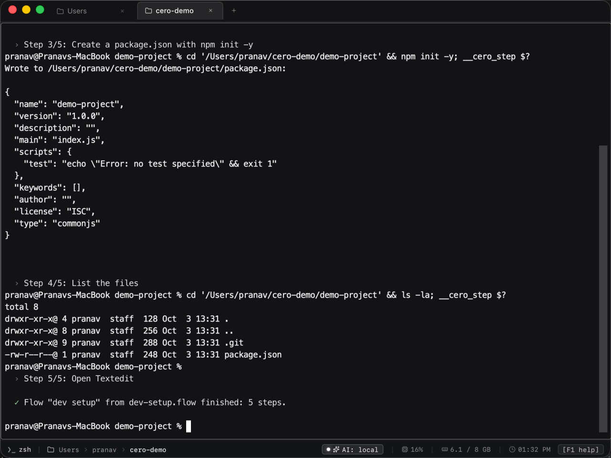
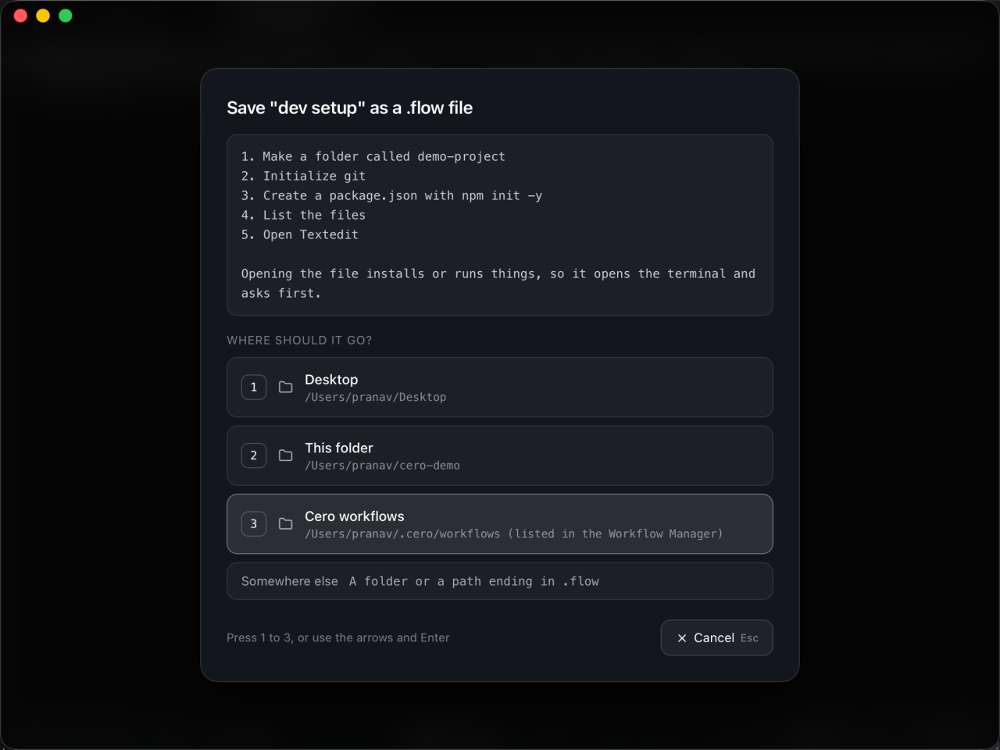
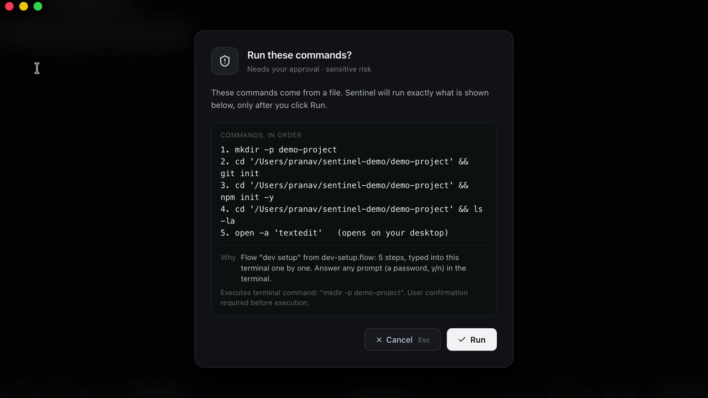
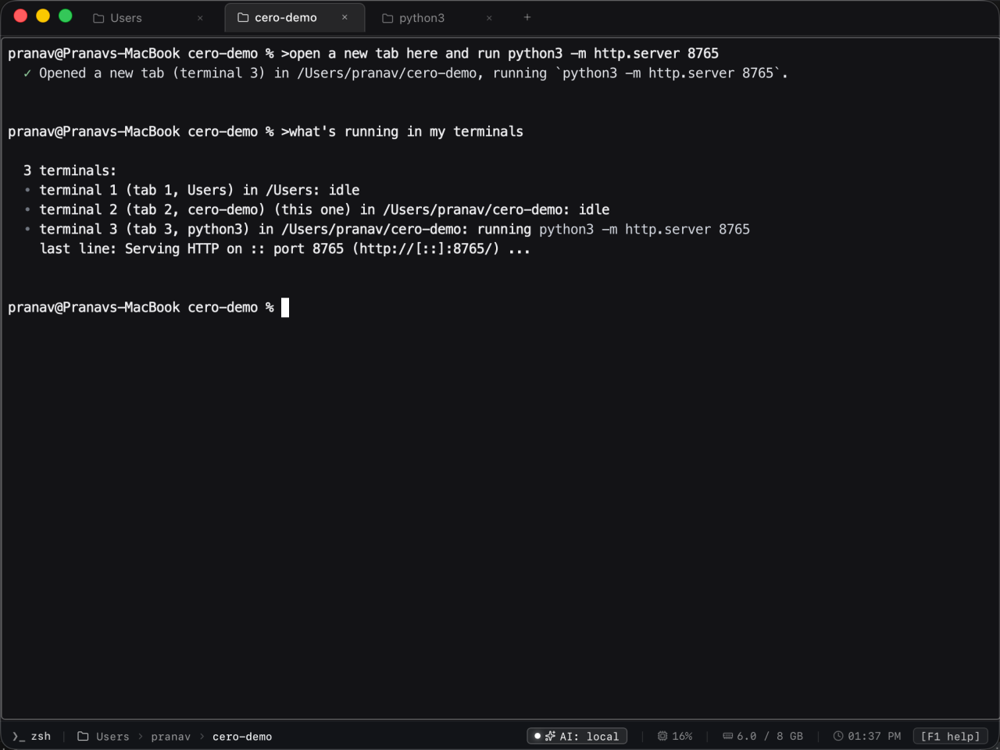
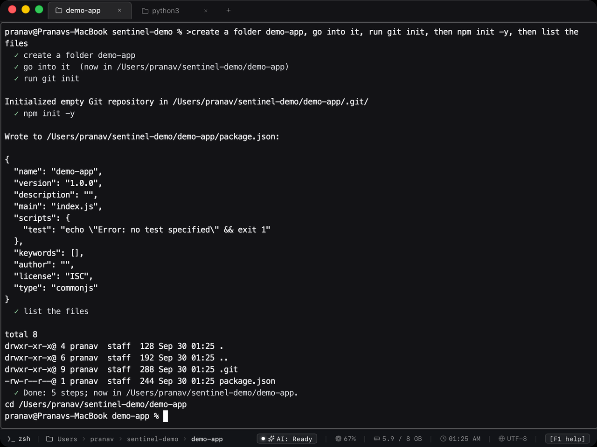
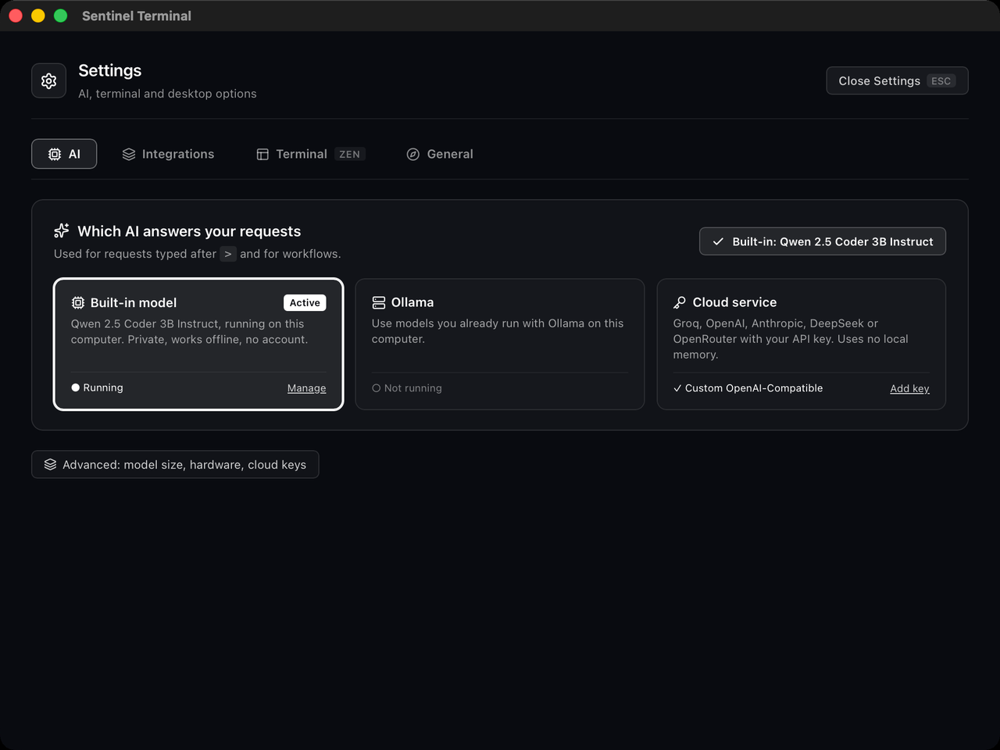

<div align="center">


# Cero

**A terminal that also takes requests in plain language, runs `.flow` setup files on any OS, and uses a model that runs on your own computer.**

[](https://github.com/NetPranav/Sentinal-Terminal/actions/workflows/ci.yml)
[](https://github.com/NetPranav/Sentinal-Terminal/releases)

[](LICENSE)

[Download](#download) · [.flow files](#flow-files-write-a-setup-once-run-it-anywhere) · [What you can ask](#what-you-can-ask) · [System settings](#system-settings-by-request) · [Build from source](#build-from-source) · [Docs](#documentation)



</div>

Cero is a desktop terminal (Tauri v2, Rust, React 19, xterm.js). Commands you type run in a real
shell: zsh or bash on macOS and Linux, PowerShell on Windows. Start a line with `>` and it becomes a request:

```text
~/demo % >what is the total of the score column in data.csv?
  ✓ The total of the score column in data.csv is 42.5 (3 rows).
```

Cero works out the commands, shows the ones that change anything for your approval, runs them in your
terminal and answers from their real output. Common requests run from tested recipes without a model call.
Everything else goes to the AI you choose in Settings:
- the built-in model (Qwen2.5-Coder 3B on llama.cpp, running on your computer, no account)
- Ollama
- a cloud key (OpenAI, Anthropic, Groq, DeepSeek, OpenRouter or any OpenAI-compatible endpoint)

With the built-in model or Ollama, requests stay on your machine. With a cloud key they go to that provider.

## Demo

<div align="center">


**Watch the demo (2.5 min):** [docs/media/cero-demo.mp4](docs/media/cero-demo.mp4). One slide per feature, then the real
app doing it, unedited: Wi-Fi off and on, joining a network, closing a port, quitting an app by name, then the main idea:
telling the terminal the steps of a workflow, saving the `.flow` file, and double-clicking it to run.
Recorded in the macOS release build. Made with the [product-demo](docs/demo/README.md) method.
</div>

## .flow files: write a setup once, run it anywhere

A `.flow` file lists what to install, run and open. A tutorial, a teammate or you can write one. Double-click
it and Cero runs it on macOS, Windows or Linux, choosing the right commands for that system.

```json
{
  "schemaVersion": "1.0",
  "metadata": { "id": "node-project", "name": "Node.js project" },
  "actions": [
    { "type": "install", "package": "nodejs" },
    { "type": "clone", "repo": "https://github.com/me/app.git", "into": "~/app" },
    { "type": "command", "command": "npm install", "cwd": "~/app" },
    { "type": "command", "command": "npm run dev", "windows": "npm.cmd run dev", "cwd": "~/app" },
    { "type": "browser", "url": "http://localhost:3000" }
  ]
}
```

| The flow contains | What happens |
|---|---|
| Only desktop actions: open Chrome, YouTube, VS Code, a folder | They open. **The terminal never appears**, and Cero quits afterwards if it was not already running. |
| Anything that installs or runs something | The terminal opens with one dialog listing every command. **Nothing runs until you click Run** (Enter does not approve a flow from a file). Each step is then typed into the terminal, so you see the output and can answer a `sudo` password or `[y/N]`. The flow stops at the first failing step. |

`install` takes one name for every OS. `nodejs` becomes `brew install node`, `winget install OpenJS.NodeJS.LTS`
or the apt, dnf, pacman or zypper package, whichever the machine has. Values are quoted by Cero, so a
flow cannot inject shell syntax through a URL, name or path. Every run is written to the audit log.

<table>
<tr>
<td width="50%"></td>
<td width="50%"></td>
</tr>
<tr>
<td align="center">One approval lists every command</td>
<td align="center">Steps typed into the terminal, output visible</td>
</tr>
</table>

### Make one by asking

You do not have to write the JSON. Tell the terminal the steps:

```text
>make me a workflow called dev setup that makes a folder called demo-project, goes into it,
 initializes git, creates a package.json with npm init -y, lists the files and opens textedit
```

Cero shows the steps in plain words, then asks where to keep the file: **1** Desktop, **2** this folder,
**3** `~/.cero/workflows` (listed in the Workflow Manager), or a path you type. It never replaces an existing
file, and a step it cannot understand is named and left out, never guessed.

<table>
<tr>
<td width="50%"></td>
<td width="50%"></td>
</tr>
<tr>
<td align="center">Describe it, choose where it goes</td>
<td align="center">Double-click it: every command, then your click</td>
</tr>
</table>

Format, actions and the package table: [docs/FLOW_FILES.md](docs/FLOW_FILES.md). Examples: [examples/flows](examples/flows).

## What you can ask

Type `>` followed by the request. Examples that were run in the release build:

| Request | What Cero does |
|---|---|
| `>what is the total of the score column in data.csv?` | Sums the column with a tested recipe and answers "42.5 (3 rows)" |
| `>show the last 2 errors in logs/app.log` | Prints the two lines |
| `>create a folder demo-app, go into it, run git init, then npm init -y, then list the files` | Plans all five steps, asks once (listing `mkdir`, `git init` and `npm init`), runs them, and leaves the shell in the new folder |
| `>open a new tab here and run python3 -m http.server 8765` | Asks once, opens the tab, starts the server there |
| `>what's running in my terminals` | Lists every terminal, its folder and its running command, without a model call |
| `>stop the server` | Confirms, then sends Ctrl+C to that tab |
| `>make me a workflow that installs node and opens youtube in safari` | Writes a `.flow` file from the steps and asks where to save it (see above) |
| `>close port 8765` | Finds what listens on exactly that port, names it (Python, PID 70334), asks, stops that process normally and checks the port is free. `force close port 8765` for `kill -9` |
| `>turn wifi off`, `>connect to wifi Home` | The exact `networksetup` / `nmcli` / Windows radio command, shown before it runs. Never asks the model, never invents a password |
| `>quit textedit`, `>terminate or stop the claude application` | Lists the running apps first, matches the name in any case ("claude" finds "Claude"), asks with the exact app, quits it normally and checks that it closed. If no running app has that name, it says so and closes nothing |
| `>run npm test in tab 2` | Types it there, or refuses and says why when that tab is busy or at a password prompt |
| `>why is npm test failing in api?` | Runs it there and explains the failure from the code it points to |
| `>fix buggy.py so it runs` | Runs the file, shows the change for approval (the original is kept as `.bak`), runs it again |
| `>open settings`, `>show my command history`, `>switch to zen mode`, `>go to tab 2` | The app's own functions |
| `>run the workflow in setup.flow` | Runs a flow from inside the terminal |

Commands that change files, the system or the network ask first and show exactly what will run. Reading
private keys or credential files always asks. Keys and tokens are masked before any output reaches a model.

<table>
<tr>
<td width="50%"></td>
<td width="50%"></td>
</tr>
<tr>
<td align="center">Other terminals, by request</td>
<td align="center">A multi-step request, planned and run</td>
</tr>
</table>

## System settings by request

`>turn wifi off`, `>set brightness to 60`, `>mute`, `>turn on dark mode`, `>show paired bluetooth devices`,
`>open sound settings`. Each request becomes the native command for your OS. Say only the topic (`>bluetooth`)
and Cero lists what it can do for it on this OS. Typing `>turn blu` completes the request.

| | macOS | Windows | Linux |
|---|---|---|---|
| Wi-Fi on/off, status, scan, join | `networksetup` | Windows radio API (same switch as Quick Settings), `netsh wlan` | `nmcli` |
| Bluetooth on/off, status, devices | `blueutil` for on/off (else the settings page), `system_profiler` | Windows radio API, `Get-PnpDevice` | `bluetoothctl`, `rfkill` |
| Brightness | Brightness keys; exact levels with the `brightness` tool | WMI (built-in displays) | `brightnessctl`, or GNOME over D-Bus |
| Volume and mute | AppleScript | Core Audio | `wpctl`, `pactl` or `amixer` |
| Dark mode | AppleScript | Registry (apps and system) | GNOME `gsettings`, KDE `plasma-apply-colorscheme` |
| Battery, lock screen | `pmset` | `Win32_Battery`, `LockWorkStation` | `/sys/class/power_supply`, `loginctl` |
| Open a settings page | `x-apple.systempreferences:` | `ms-settings:` | GNOME Settings or KDE System Settings |

Changes ask first. When a switch is blocked (no radio, a policy, an external monitor without brightness
control), Cero says why and opens the matching settings page.

## Settings

<div align="center">

</div>

One question: which AI answers your requests. The built-in model downloads its engine (llama.cpp: Metal on
macOS, Vulkan or CPU on Windows and Linux) and the 2 GB model from here. Model size, hardware and cloud keys
are under Advanced.

## Download

Version 2.1.0. Each platform has its own release, built from its own branch.

| Platform | Files | Release |
|---|---|---|
| macOS, Apple Silicon | [`Cero.Terminal_2.1.0_aarch64.dmg`](https://github.com/NetPranav/Sentinal-Terminal/releases/download/v2.1.0-macos/Sentinel.Terminal_2.1.0_aarch64.dmg) | [v2.1.0-macos](https://github.com/NetPranav/Sentinal-Terminal/releases/tag/v2.1.0-macos) |
| macOS, Intel | [`Cero.Terminal_2.1.0_x64.dmg`](https://github.com/NetPranav/Sentinal-Terminal/releases/download/v2.1.0-macos/Sentinel.Terminal_2.1.0_x64.dmg) | |
| Arch, Manjaro, EndeavourOS | [`cero-terminal-bin-2.1.0-1-x86_64.pkg.tar.zst`](https://github.com/NetPranav/Sentinal-Terminal/releases/download/v2.1.0-linux/sentinel-terminal-bin-2.1.0-1-x86_64.pkg.tar.zst) | [v2.1.0-linux](https://github.com/NetPranav/Sentinal-Terminal/releases/tag/v2.1.0-linux) |
| Ubuntu 22.04+, Debian 12, Mint, Pop!_OS | [`Cero.Terminal_2.1.0_amd64.deb`](https://github.com/NetPranav/Sentinal-Terminal/releases/download/v2.1.0-linux/Sentinel.Terminal_2.1.0_amd64.deb) | |
| Fedora 38+, openSUSE | [`Cero.Terminal-2.1.0-1.x86_64.rpm`](https://github.com/NetPranav/Sentinal-Terminal/releases/download/v2.1.0-linux/Sentinel.Terminal-2.1.0-1.x86_64.rpm) | |
| Other x86_64 Linux | [`Cero.Terminal_2.1.0_amd64.AppImage`](https://github.com/NetPranav/Sentinal-Terminal/releases/download/v2.1.0-linux/Sentinel.Terminal_2.1.0_amd64.AppImage) | |
| Windows 10 (1803+) and 11 | [`Cero.Terminal_2.1.0_x64_en-US.msi`](https://github.com/NetPranav/Sentinal-Terminal/releases/download/v2.1.0-windows/Sentinel.Terminal_2.1.0_x64_en-US.msi) or [`Cero.Terminal_2.1.0_x64-setup.exe`](https://github.com/NetPranav/Sentinal-Terminal/releases/download/v2.1.0-windows/Sentinel.Terminal_2.1.0_x64-setup.exe) | [v2.1.0-windows](https://github.com/NetPranav/Sentinal-Terminal/releases/tag/v2.1.0-windows) |

Each release has a `SHA256SUMS.txt`.

The optional `cero` command opens the app in a folder or runs a `.flow` file from any shell: see [assets/cli](assets/cli).

**First launch**
- **macOS:** the app is not notarized. macOS blocks the first launch. Open System Settings, then Privacy & Security, and choose "Open Anyway".
- **Windows:** the installers are not code-signed. SmartScreen shows "Windows protected your PC". Choose "More info", then "Run anyway".
- **Linux:**
  - Install the package: `sudo pacman -U ...`, `sudo apt install ./...deb` or `sudo dnf install ./...rpm`.
  - The packages need WebKitGTK 4.1, which the package manager installs.
  - The packages also register the `.flow` file type.

### How well each platform is tested

| | macOS | Linux | Windows |
|---|---|---|---|
| Builds and unit tests in CI | Yes | Yes | Yes |
| Run by hand in the release build (requests, tabs, flows, settings) | Yes, Apple Silicon on macOS 26 | Not yet | Not yet |
| System-settings commands | Read commands run on a Mac | Covered by tests | Every script parse-checked by PowerShell in CI; not yet run on a Windows PC |

Please [open an issue](https://github.com/NetPranav/Sentinal-Terminal/issues) if something does not work on
your system.

## Build from source

Requirements: Node.js 20+, Rust (stable), and the [Tauri v2 prerequisites](https://v2.tauri.app/start/prerequisites/)
for your OS (WebKitGTK 4.1 on Linux, WebView2 on Windows).

```bash
npm install
npm run tauri dev          # run the app in development
npm run check:triple       # tests, production build and cargo check
npm run bundle:dmg         # macOS installer (bundle:deb, bundle:rpm, bundle:appimage on Linux)
```

Other scripts:
- `npm run cli`: the agent in a plain terminal, useful for trying requests without the window.
- [`assets/cli`](assets/cli): the `cero` command (`cero ~/project`, `cero setup.flow`) for macOS, Linux and Windows.
- `npm run stress`: the complex-request suite against a running local model.
- `npm run smoke:engine`: checks that a llama.cpp server starts and accepts Cero's grammar.

Releases: `scripts/release.sh macos|linux|windows|all` pushes the platform branches (`release/macos`,
`release/linux`, `release/windows`). CI then builds and publishes each release.

## Documentation

| | |
|---|---|
| [docs/FLOW_FILES.md](docs/FLOW_FILES.md) | The `.flow` format and how each OS runs it |
| [docs/ROADMAP.md](docs/ROADMAP.md) | The current fix plan: step-by-step tasks for the problems found on Linux |
| [docs/releases](docs/releases) | Release notes per platform |
| [docs/CODEBASE_MAP.md](docs/CODEBASE_MAP.md) | Where things live in the code |

## License

[MIT](LICENSE)
